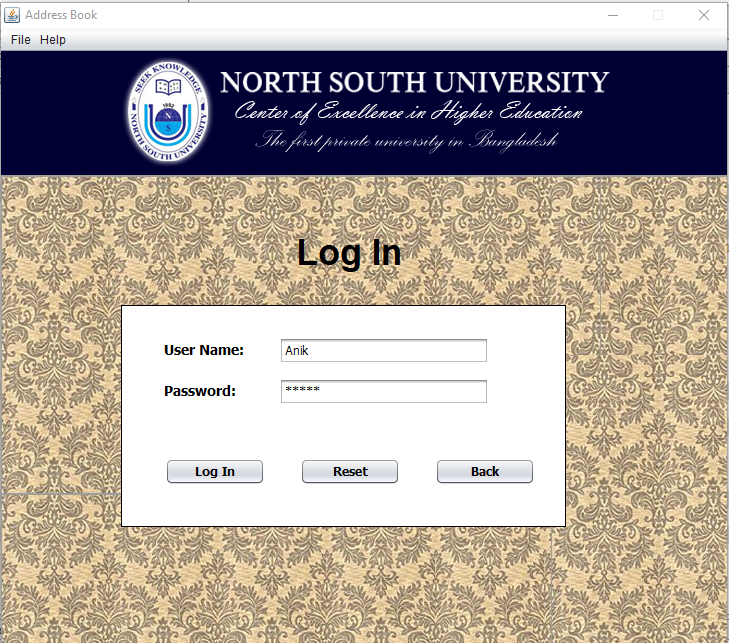

# OnlineAddressbook
This Project takes the information of a person and stores that info to the database and later shows that to the user by searching.
This project has made by JAVA programming language and in NetBeans IDE. 

1. HOME PAGE: 

2. LOGIN PAGE:

3. MAIN MENU

4. ADDINFO PAGE:

5. SEARCH PAGE:

6. SHOWINFO PAGE:

